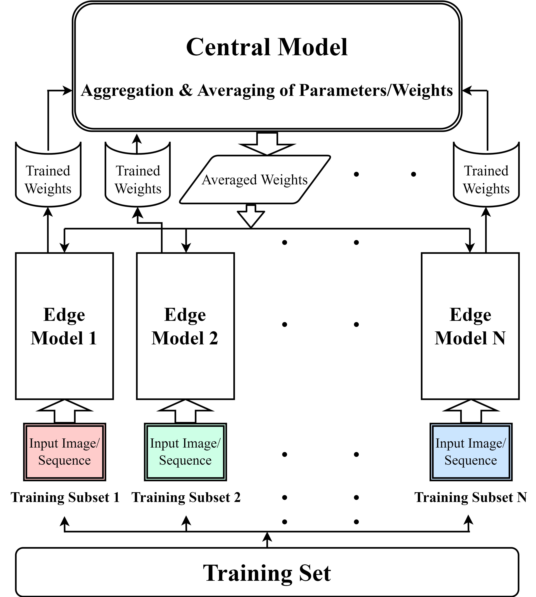

# Dynamic Uncertainty-Aware Divide2Conquer (DUA-D2C)
**Official TensorFlow/Keras implementation for the paper: "DUA-D2C: Dynamic Uncertainty Aware Method for Overfitting Remediation in Deep Learning"**

This repository contains codes on the implementation of DUA-D2C, a novel technique designed to address Overfitting. The separate folders contain samples of different types of experiments on different datasets from different domains. Our experiments were performed using Google Colab. Both A100 and V100 GPUs were used. We used TensorFlow 2.12.1 for the implementations.

> **Summary:** Deep Learning models often achieve high performance on their training data, yet this performance can drop significantly on unseen data from different distributions, a phenomenon known as overfitting. While traditional regularization techniques like Dropout and Early Stopping provide partial solutions, they still allow models to over-adapt to the entire training set comprising of outliers and noise. We propose Dynamic Uncertainty-Aware Divide2Conquer (DUA-D2C), an innovative framework that addresses overfitting by partitioning training data into multiple subsets and training separate models on each. Unlike standard ensemble methods, DUA-D2C employs a novel aggregation mechanism that dynamically weights each subset model's contribution based on both validation accuracy and prediction uncertainty. This intelligent fusion allows the central model to preferentially learn from subsets demonstrating superior generalization and confidence, effectively reducing variance and improving robustness. Our method demonstrates significant performance improvements across multiple datasets, providing a mathematically-grounded approach to combat overfitting while maintaining computational efficiency.

---

## Method Overview

DUA-D2C extends the original Divide2Conquer framework with dynamic, performance-driven aggregation:
1.  **Data Partitioning:** Training data is divided into N disjoint subsets while maintaining class distributions.
2.  **Parallel Training:** Identical models are trained on each subset for E local epochs.
3.  **Intelligent Aggregation:** Subset models are weighted using a composite metric combining: i) Validation Accuracy (measures performance) & ii) Prediction Entropy (measures uncertainty/confidence).
4.  **Central Model Update:** Weighted average of subset parameters updates the central model.
5.  **Iterative Refinement:** Process repeats for multiple global communication rounds.



---

## Key Results

DUA-D2C consistently outperforms both standard training and the original D2C method across various datasets:

| Dataset | Standard Training | D2C (Original) | DUA-D2C | Performance Gain vs. Standard |
| :--- | :--- | :--- | :--- | :--- |
| **AG News** | 92.43% Acc. | 92.95% Acc. | **93.12% Acc.** | **+0.69%** |
| **CIFAR-10** | 86.04% Acc. | 86.13% Acc. | **86.52% Acc.** | **+0.48%** |
| **Audio (Combined)** | 0.6870 F1. | 0.6909 F1. | **0.6973 F1.** | **+1.03%** |
| **MNIST** | 99.52% Acc. | 99.59% Acc. | **99.63% Acc.** | **+0.11%** |

The uncertainty-aware aggregation provides consistent improvements over data-size-based weighting, particularly on larger and noisy datasets.

---

## Setup and Installation

This project is built using TensorFlow 2.12.1.

**1. Clone the repository:**
```bash
git clone https://github.com/Saiful185/DUA-D2C.git
cd DUA-D2C
```

**2. Install dependencies:**
It is recommended to use a virtual environment.
```bash
pip install -r requirements.txt
```
Key dependencies include: `tensorflow`, `pandas`, `opencv-python`, `librosa`, `scikit-learn`, `seaborn`.

---

## Dataset Preparation

The experiments are run on four publicly available datasets. For fast I/O, it is highly recommended to download the datasets, zip them, upload the zip file to your Google Drive, and then use the unzipping cells in the Colab notebooks.

#### 1. AG News
- **Download:** From the [Kaggle dataset page](https://www.kaggle.com/datasets/amananandrai/ag-news-classification-dataset). 
  
#### 2. FER2013
- **Download:** From the [Kaggle dataset page](https://www.kaggle.com/datasets/msambare/fer2013).

#### 3. TESS (Audio)
- **Download:** From the [Kaggle dataset page](https://www.kaggle.com/datasets/ejlok1/toronto-emotional-speech-set-tess).

#### 4. CREMA-D (Audio)
- **Download:** From the [Kaggle dataset page](https://www.kaggle.com/datasets/ejlok1/cremad).

#### 5. RAVDESS (Audio)
- **Download:** From the [Kaggle dataset page](https://www.kaggle.com/datasets/uwrfkaggler/ravdess-emotional-speech-audio).

The rest of the datasets (MNIST, Fashion MNIST, CIFAR-10) are readily available with tensorflow/keras.

---

## Usage: Running the Experiments

The code is organized into Jupyter/Colab notebooks (`.ipynb`) for each key experiment.

1.  **Open a notebook** (e.g., `DUA_D2C_AG News.ipynb`).
2.  **Update the paths** in the first few cells to point to your dataset's location (either on Google Drive for unzipping or a local path).
3.  **Run the cells sequentially** to perform data setup, model training, and final evaluation.

---

## Citation

If you find this work useful in your research, please consider citing our paper:

```bibtex
@article{siddiqui2025duad2c,
      title={DUA-D2C: Dynamic Uncertainty Aware Method for Overfitting Remediation in Deep Learning},
      author={Md. Saiful Bari Siddiqui and Md Mohaiminul Islam and Md. Golam Rabiul Alam},
      year={2025},
      eprint={2411.15876},
      archivePrefix={arXiv},
      primaryClass={cs.LG},
      url={https://arxiv.org/abs/2411.15876}, 
}
```

---

## License
This project is licensed under the MIT License. See the `LICENSE` file for details.
